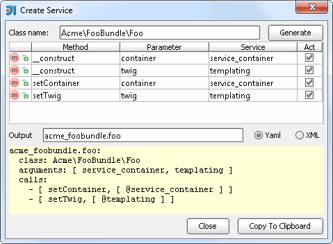

.. index::
   single: Actions

Actions
========================

Service Builder
-------------------------

.. code-block:: php

  # Symfony\Bundle\FrameworkBundle\Controller\Controller::generateUrl
  namespace Acme\FooBundle;
  class Foo extends ContainerAware {}
  class Foo {}
  
* ``action`` - Class definition name or context of yaml or yml

Profiler Statusbar
-------------------------

Search for profiler config in container folders and provide internal targets for related latest Requests.

Translation Extractor
-------------------------

.. code-block:: html+jinja

  
foo

  

