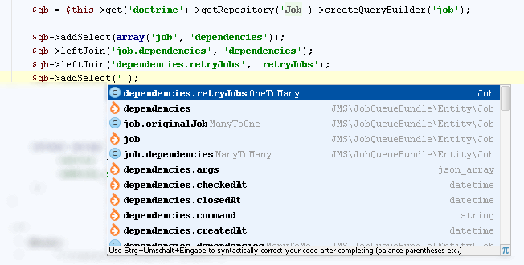

.. index::
   single: Doctrine QueryBuilder

Doctrine QueryBuilder
========================
Provide return types for Method calls

Roots Entity
-------------------------

Every querybuilder object need to have a root entity, some provider are in

.. code-block:: php   

    // PhpTypeProvider
    $repository = $foo->getRepository('BundleName');
    $qb = $repository->createQueryBuilder('test')->addSelect('test');
    
    // \Doctrine\Common\Persistence\ObjectRepository
    class FooRepository extends EntityRepository {
        public function foo() {
          $qb = $this->createQueryBuilder('foo_alias');
        }
    }
    
    // \Doctrine\ORM\QueryBuilder::from    
    $qb = $this->getEntityManager()->createQueryBuilder();
    $qb->from('Foo\Class', 'foo')

    // inline
    $qb = $em->getRepository('FooBundle:FooEntity')->createQueryBuilder('foo')
    

Supported Calls
-------------------------

.. code-block:: php   

    $qb->select('job');
    $qb->select(array('job', 'dependencies'));
    
    $qb->addSelect('job');
    $qb->addSelect(array('job', 'dependencies'));
    
    $qb->setParameter('foo');
    $qb->setParameters(array('foo' => 'bar'));
    
    $qb->join('foo.bar', 'bar');
    // and all other joins
    
    $qb->groupBy('foo.bar');
    $qb->addGroupBy('foo.bar');
    
    $qb->orderBy('foo.bar');
    $qb->addOrderBy('foo.bar');    

