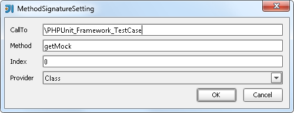

.. index::
   single: Signature Types

Signature Types
========================
Provide return types for Method calls

Settings
-------------------------

* ``CallTo`` - Class or interface name (prefer use Interface) should FQN and start with ``\``
* ``Method`` - Method name
* ``Index`` - Parameter of Method containing string to resolve (starts with 0)   
* ``Provider`` - Provider which can resolve the string  

Example
-------------------------

.. code-block:: php   

    # \PHPUnit_Framework_TestCase:getMock:0:Class
    class MyTest extends \PHPUnit_Framework_TestCase {
    	function testAppConfig() {
    	  $mock = $this->getMock('ClassName');
      }
    }

* ``type`` - Return type of the Mock        
* ``goto`` - You can also use "Method Reference" to get class support
* ``complete`` - use "Method Reference"
