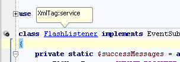
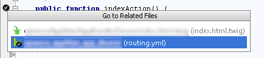

.. index::
   single: PHP

PHP
========================

Templates
-------------------------

.. code-block:: php

  # Symfony\Bundle\FrameworkBundle\Controller\Controller
  # Symfony\Bundle\TwigBundle\TwigEngine
  $this->render('<template.html.twig>')
  $this->renderView('<template.html.twig>')
        
based on ``BundleInterface``, ``addPath`` of container and custom path of settings

* ``goto`` - Template file
* ``complete`` - Template names  
* ``annotator`` - Mark missing template and provides twig template create action

.. code-block:: php

	/**
	 * @Template()
	 */
	public function indexAction() { }
 
.. code-block:: php

	/**
	 * @Template("<template.html.twig>")
	 */
	public function indexAction() { }

* ``goto`` - Template on click of ``@Template``
* ``complete`` - Template names  
* ``annotator`` - Mark missing template and provides twig template create action

.. code-block:: php

  '<template.html.twig>'
 
all string ending with ``.twig`` provides goto
 
 
Service / Parameter
-------------------------
.. code-block:: php

  # Symfony\Component\DependencyInjection\ContainerInterface::get
  $this->container->get('<service_name>');
  $this->container->get(SERVICE::NAME);  
  $this->container->get($this->name);  

* ``goto`` - Goto service class
* ``complete`` - Service name
* ``annotator`` - Mark missing service
* ``type`` - The class type of service definition

.. code-block:: php

  # Symfony\Component\DependencyInjection\ContainerInterface::has
  $this->container->has('<service_name>');
  
* ``goto`` - see above
* ``complete`` - see above

.. code-block:: php

  # \Symfony\Component\DependencyInjection\ContainerInterface::*
  $this->container->getParameter('<parameter>');
  $this->container->hasParameter('<parameter>');
  
* ``complete`` - Defined parameter
  
Container Builder
-------------------------
.. code-block:: php

  # \Symfony\Component\DependencyInjection\Reference
  new Reference('<service_name>');

  # \Symfony\Component\DependencyInjection\Definition
  new Definition('<class>');
  
  # \Symfony\Component\DependencyInjection\Alias
  new Alias('<service_name>');
  
  # \Symfony\Component\DependencyInjection\ContainerBuilder::setAlias
  $container->setAlias('alias', '<service_name>');
  
  # \Symfony\Component\DependencyInjection\ContainerBuilder::findDefinition
  $container->findDefinition('<service_name>');
  
  # \Symfony\Component\DependencyInjection\ContainerBuilder::hasDefinition
  $container->hasDefinition('<service_name>');

  # \Symfony\Component\DependencyInjection\ContainerBuilder::getDefinition
  $container->getDefinition('<service_name>');    
  
  # \Symfony\Component\DependencyInjection\ContainerBuilder::findTaggedServiceIds
  $container->findTaggedServiceIds('<tag>');

* ``goto`` - tags: all tagged services

.. note::
  All ContainerBuilder calls provides access to service-index which includes private ones
  
Doctrine
-------------------------
  
.. code-block:: php

  $em->getRepository(Entity::class);
  $em->getRepository($this->foo);
  $em->getRepository('<FooBundle:Entity>');
  
* ``goto`` - Go to entity class
* ``complete`` - All classes in Doctrine entity namespaces as shortcut name 
* ``type`` - Return repositoryClass of entity supported parser in order: annotations, yaml, CLASSRepository 
  
.. note::
  Entities in subfolder are not supported because of PhpStorm issues
  
.. code-block:: php
 
  $em->getRepository('<FooBundle:Entity>')->find(1);
  $em->getRepository('<FooBundle:Entity>')->findOneBy(array());
  $em->getRepository('<FooBundle:Entity>')->findBy(array());
  $em->getRepository('<FooBundle:Entity>')->findAll();

* ``type`` - Return Entity or Entity[]
  
.. code-block:: php

  # Doctrine\Common\Persistence\ObjectManager::find
  $em->find('FooBundle:Invite', 1) ;
  
* ``type`` - Return Entity
* ``goto`` - see above
* ``type`` - see above
  
  
Translation
-------------------------  
.. code-block:: php

  #Symfony\Component\Translation\Translator::trans
  #Symfony\Component\Translation\Translator::transChoice
  
  $t->trans('translation.key', array(), '<Domain>')
  $t->transChoice('translation.key', 2, array(), '<Domain>')

* ``goto`` - Domain file like yaml or other, from container file
* ``complete`` - Domain file like yaml or other, from container file
* ``annotator`` - Mark missing domain files
  
.. code-block:: php

  # Symfony\Component\Translation\Translator::trans
  # Symfony\Component\Translation\Translator::transChoice
  
  $t->trans('<translation.key>', array(), 'Domain')
  $t->transChoice('<translation.key>', 2, array(), 'Domain')
  
* ``goto`` - Yaml Key-Value of Domain, default ``messages`` or ``trans_default_domain`` of current file 
* ``complete`` - All known translation key filtered by domain name  
* ``annotator`` - Mark missing translation and provide quick fix, which create key inside domain file
  
Routing
-------------------------

.. code-block:: php

  # Symfony\Bundle\FrameworkBundle\Controller\Controller::generateUrl
  $this->generateUrl('_configurator_final', array('parameter' => 'test'))
  
* ``goto`` - Controller action method and parameter
* ``complete`` - Routing name and parameter of eg. appDevUrlGenerator.php 
* ``annotator`` - Mark missing routing name 
 
.. code-block:: php
  
  # Symfony\Bundle\FrameworkBundle\Controller\Controller::forward
  $this->forward('<controller_action>', array('parameter' => 'test'))

* ``goto`` - Controller action method
* ``complete`` - Controller names of Bundle structure or controller services as shortcut 

.. code-block:: php
  
  # Symfony\Bundle\FrameworkBundle\Controller\Controller::forward
  # Symfony\Bundle\FrameworkBundle\Controller\Controller::generateUrl
  $this->generateUrl('<controller_action>', array('<parameter>' => 'test'))

* ``goto`` - Method Parameter
* ``complete`` - Parameters of route  
 
 
Forms
-------------------------

.. code-block:: php

  # Symfony\Component\Form\FormBuilderInterface::add
  $builder->add('field', '<complete>');
  
* ``goto`` - resolved class
* ``complete`` - Registered FormTypes aliases
 
.. code-block:: php
  
  # Symfony\Component\Form\FormBuilderInterface::add
  $builder->add('field', 'button' , array(
    'label' => '<translation_key>',
    'help_inline' => '<translation_key>',
    'help_block' => '<translation_key>',
    'translation_domain' => '<translation_domain>',
  ));

* ``goto`` - Translation definition
* ``complete`` - Translation key or domain 

.. note::
  also ``translation_domain`` inside ``OptionsResolverInterface::setDefaults`` is supported for filter

.. code-block:: php
  
  # Symfony\Component\OptionsResolver\OptionsResolverInterface::setDefaults
  $resolver->setDefaults(array(
    'data_class' => '<entity_class>'
  ));
  
  # Symfony\Component\Form\FormBuilderInterface::add
  $builder->add('field', 'form_alias'|FormTypeInterface, array(
    'class' => '<entity_class>'
  ));

* ``goto`` - Class definition
* ``complete`` - Class name of doctrine namespaced entities

.. code-block:: php

  # Symfony\Component\Form\FormBuilderInterface::add
  $builder->add('field', 'form_alias'|FormTypeInterface, array(
    '<option>' => ''
  ));

* ``goto`` - tagged form extension with ``form.type_extension`` or ``getParent`` tree of known form_type
* ``complete`` - name for option

.. code-block:: php
  
  # Symfony\Component\OptionsResolver\OptionsResolverInterface::setDefaults
  $resolver->setDefaults(array(
    '<form_options|form_extensions>' => ''
  ));
  
  # Symfony\Component\Form\FormBuilderInterface::add
  $builder->add('field', 'form_alias'|FormTypeInterface, array(
    '<form_options|form_type_options|form_extensions>' => ''
  ));  
  
* ``goto`` - array definition of option
* ``complete`` - all matched form options

.. code-block:: php

  # Symfony\Component\Form\FormFactory::create
  # Symfony\Component\Form\FormFactory::createNamedBuilder
  # Symfony\Bundle\FrameworkBundle\Controller\Controller::createForm
  $this->createForm('button', "type", array(
    '<option>' => 'foo'
  ));  
  
* ``goto`` - array definition of option
* ``complete`` - all matched form options

.. note::
  Types are resolve on parents and other condition

.. code-block:: php
  
  # \Symfony\Component\Form\Form::get
  # \Symfony\Component\Form\Form::has
  $form->get('<foo>');
  
EventDispatcher
-------------------------
.. code-block:: php

  # Symfony\Component\EventDispatcher\EventSubscriberInterface::getSubscribedEvents
  return array(
    '<event_name>' => array()
  );

.. code-block:: php

  # Symfony\Component\EventDispatcher\EventDispatcherInterface::dispatch
  $this->get('event_dispatcher')->dispatch('<event_name>')  
  
* ``goto`` - All class that use same event name
* ``complete`` - Event name

Class
-------------------------
.. code-block:: php

  class FlashListener implements EventSubscriberInterface {}  

  

* ``lineMarker`` - Mark line and provide goto if a service is known definition
* ``goto`` - class service definition

.. note::
  Includes private services
  
Related Files
------------------------- 

Controller method provide related files popover as line marker

.. code-block:: php

	public function indexAction() {}

* ``lineMarker`` - Provide related file like routes and templates

