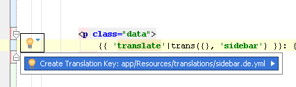
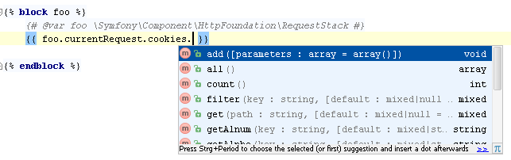

.. index::
   single: Twig

Twig
========================

Variables
-------------------------

Support variables parser:
- `Twig_Environment:addGlobal` of container file

Templates
-------------------------

.. code-block:: html+jinja

    
    
  
  {{ include('<template.html.twig>') }}
  
based on ``BundleInterface``, ``addPath`` of container and custom path of settings

* ``goto`` - open file
* ``complete`` - template names 
* ``annotator`` - Notice missing template and create action

.. code-block:: html+jinja

  
  {{ your_function('<template.html.twig>') }}
 
all string ending with ``.twig`` provides goto
 
Blocks
-------------------------
  
.. code-block:: html+jinja

  
  
  
  
based on extends tag upwards
  
* ``goto`` - Parent block
* ``complete`` - All parent blocks 
  
  
Functions / Macros
-------------------------

.. code-block:: html+jinja

   
  
.. code-block:: html+jinja

  
  {{ widget_panel() }}  

.. code-block:: html+jinja

  
  {{ <widget_panel>() }}  
  
.. code-block:: html+jinja

  
  {{ <widget.widget_panel()> }}
  
.. code-block:: html+jinja

  
  {{ <var_name> }}
  
Extension
-------------------------
  
.. code-block:: html+jinja 

  {{ <Twig_Function_Method()> }}
  {{ <Twig_Function_Node()> }}  
  {{ <Twig_SimpleFunction()> }}
  
based on ``Twig_ExtensionInterface`` and simple regular expression
  
* ``goto`` - Php function or method
* ``complete`` - twig extension name 
  
Filter
-------------------------
.. code-block:: html+jinja

  {{ 'name'|<filter> }}
  
* ``goto`` - Method or function of filter
* ``complete`` - Twig_SimpleFilter, Twig_Filter_Function, Twig_Filter_Method inside `Twig_ExtensionInterface::getFilters`
  
.. note::
  not fully supported by PhpStorm, autocomplete dialog is a char type event
  
Assets
-------------------------

.. code-block:: html+jinja

    
  
.. code-block:: html+jinja

      

.. code-block:: html+jinja

  {{ asset('assets/css/style.css') }}
  
* ``goto`` - Open file
* ``complete`` - Bundle or asset file
* ``annotator`` - Mark missing file or for wildcards folder
  
Translation
-------------------------  
.. code-block:: html+jinja

  {{ 'translation.key'|trans({}, '<Domain>') }}
  {{ 'translation.key'|transchoice({}, 2, '<Domain>') }}

* ``goto`` - Domain file like yaml or other, from container file
* ``complete`` - Domain file like yaml or other, from container file
* ``annotator`` - Mark missing domain files
  
.. code-block:: html+jinja

  {{ '<translation.key>'|trans({}, 'Domain') }}
  {{ '<translation.key>'|transchoice({}, 2, 'Domain') }}
  
* ``goto`` - Yaml Key-Value of Domain, default ``messages`` or ``trans_default_domain`` of current file 
* ``complete`` - All known translation key filtered by domain name  
* ``annotator`` - Mark missing translation and provide quick fix, which create key inside domain file

.. code-block:: html+jinja

  
  
* ``goto`` - Translation domain file
* ``complete`` - Registered translation domains

  
Routing
-------------------------

.. code-block:: html+jinja

  {{ path('_profiler') }}
  
* ``goto`` - Controller action method
* ``complete`` - Routing name out of eg. appDevUrlGenerator.php 
* ``annotator`` - Mark missing routing name 

.. code-block:: html+jinja

  {{ path('_profiler', {'parameter': '') }}
  
* ``goto`` - Method parameter of matching controller method
* ``complete`` - Method parameter
 
.. code-block:: html+jinja

  {{ controller('FooBundle:Bar:index') }}

* ``goto`` - Controller action method
* ``complete`` - Controller names of Bundle structure or controller services 

PhpTypes
-------------------------

.. code-block:: html+jinja

  
  {{ variable_name.method.subMethod }}
  
* ``goto`` - Class name or method
* ``complete`` - class name or method with twig shortcut name and inside class name inside comment

Possible Scopes

.. code-block:: html+jinja

  // block
  
    {# variable_name \Foo\Bar % #}
  
  
  // foreach
  
    {# variable_name \Foo\Bar #}
  
  
  // file
  
  {# variable_name \Foo\Bar #}

  