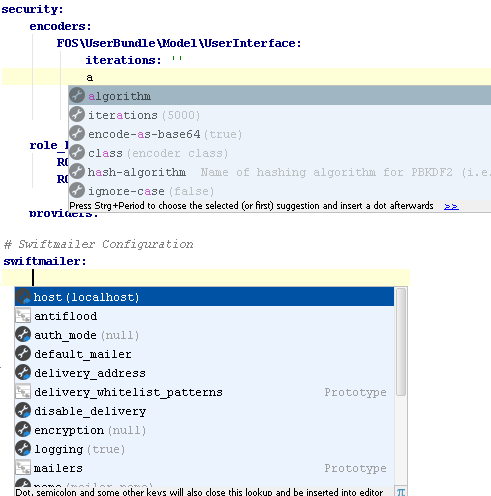

.. index::
   single: Yaml

Yaml
========================

Global
-------------------------
.. code-block:: yaml
  
  foo_bar: %<parameter>%
  foo_bar: @<service>
  foo_bar: <Class\Name>
  foo_bar: <FooBundle:Template:name.html.twig>
  foo_bar: <FooBundle:Template:name.php>
  
.. note::
  goto where possible   
  
Parameter
-------------------------
.. code-block:: yaml

  parameters:
    parameter_name.class: <class>

* ``complete`` - Class name
* ``goto`` - Class
* ``annotator`` - Missing class
    
Services
-------------------------

.. code-block:: yaml

  services:
    class: <FooBarClassOrParameter>

* ``complete`` - Parameter or class name
* ``goto`` - Resolved class 
* ``annotator`` - Missing class

based on container and local file parser   
    
.. code-block:: yaml

  services:
    class: FooBarClassOrParameter
    tags:
      - { name: <tag_name>, event: <event_name>, method: <method_name> }

* ``complete`` - All known tags, events and public methods
* ``goto`` - tags: all tagged services or classes that also provide event name

.. code-block:: yaml

  services:
    class: FooBarClassOrParameter
    calls:
      - [ <setContainer>, ... ]                

* ``complete`` - Public methods of service class
* ``goto`` - Class method

.. code-block:: yaml

  services:
    mopa_bootstrap.menu:
      class: Knp\Menu\MenuItem
      factory_service: annotation_reader
      factory_method: createFoo
    
* ``complete`` - factory_method and factory_service 
   
.. code-block:: yaml

  services:
    foo.bar:
        class: Foo\Class
        arguments: [@instance]        
        calls:
            - [ setContainer, [ @instance ] ]
    
* ``annotator`` - check method parameter instance 
                   
Routing
-------------------------

.. code-block:: yaml

  route_name:
    pattern:  /dashboard
    defaults: { _controller: <controller>}
    
* ``goto`` - Controller action
* ``complete`` - Controller actions

.. code-block:: yaml

  opwoco_apptitan_admin:
    resource: "<@FooBundle/Resources/config/routing.yml>"
    prefix:   /

* ``goto`` - Resource file
* ``complete`` - Resource files

Doctrine
-------------------------
.. code-block:: yaml

  targetEntity: <EntityClass>
  
* ``complete`` - All doctrine entity classes

.. code-block:: yaml

  title:
    type: <string>
  manyToOne:
    map:
      <config>: value
      
.. note::
  and many more    
  
Config
-------------------------  

Use command ``config:dump-reference`` to create per bundle file and merge them in the following way under project ``idea/symfony2-config.xml``. If you dont provide this file an internal fallback will occur.

.. code-block:: xml

  <config>

    <!-- Namespace: http://symfony.com/schema/dic/symfony_extra -->
    <sensio-framework-extra>
      <router annotations="true" />
      <request converters="true" />
      <view annotations="true" />
      <cache annotations="true" />
      <security annotations="true" />
    </sensio-framework-extra>
  
    <!-- Namespace: http://symfony.com/schema/dic/webprofiler -->
    <web-profiler
        toolbar="false"
        position="bottom"
        intercept-redirects="false"
    />
    
  </config>
